# 🎬 CineGo

[](https://react.dev/)
[](https://nodejs.org/)
[](https://www.mongodb.com/)
[](https://expressjs.com/)
[](https://tailwindcss.com/)
[](https://stripe.com/)

---

# 🎥 About CineGo

**CineGo** is a full-stack **Movie Ticket Booking Web Application** built using the **MERN Stack (MongoDB, Express.js, React.js, Node.js).**

It allows users to browse movies, watch trailers, select seats, and book tickets with secure online payments.

This project simulates a real-world platform like **BookMyShow**, focusing on:

- Clean UI/UX
- Real booking logic
- Secure authentication
- Admin movie management
- Payment verification flow

A strong portfolio-ready full-stack project.

---

# ✨ Features

## 🎟 User Features (Client)

- Browse movies & trailers
- Movie detail pages
- Modern seat selection UI
- Real-time seat availability
- Secure login & signup
- JWT authentication
- Stripe payment flow
- Booking history
- QR ticket generation
- Fully responsive design

---

## 🛠 Admin Features

- Admin dashboard
- Add new movies
- Manage movie listings
- View all bookings
- Upload posters & assets
- Manage shows & schedules

---

## 💳 Payment

- Stripe integration
- Payment verification page
- Secure booking confirmation
- Ticket QR generation

---

# 🛠️ Technologies Used

## Frontend (Client & Admin)

- React (Vite)
- Tailwind CSS
- Axios
- React Router DOM
- React Toastify
- QR Code Generator

---

## Backend (Server)

- Node.js
- Express.js
- MongoDB & Mongoose
- JWT Authentication
- Stripe Integration
- REST APIs

---

# 📸 Screenshots

## 🎬 Client (User Side)

### Home

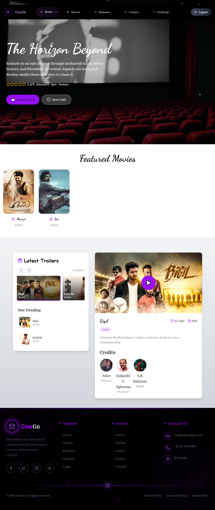

### Movies

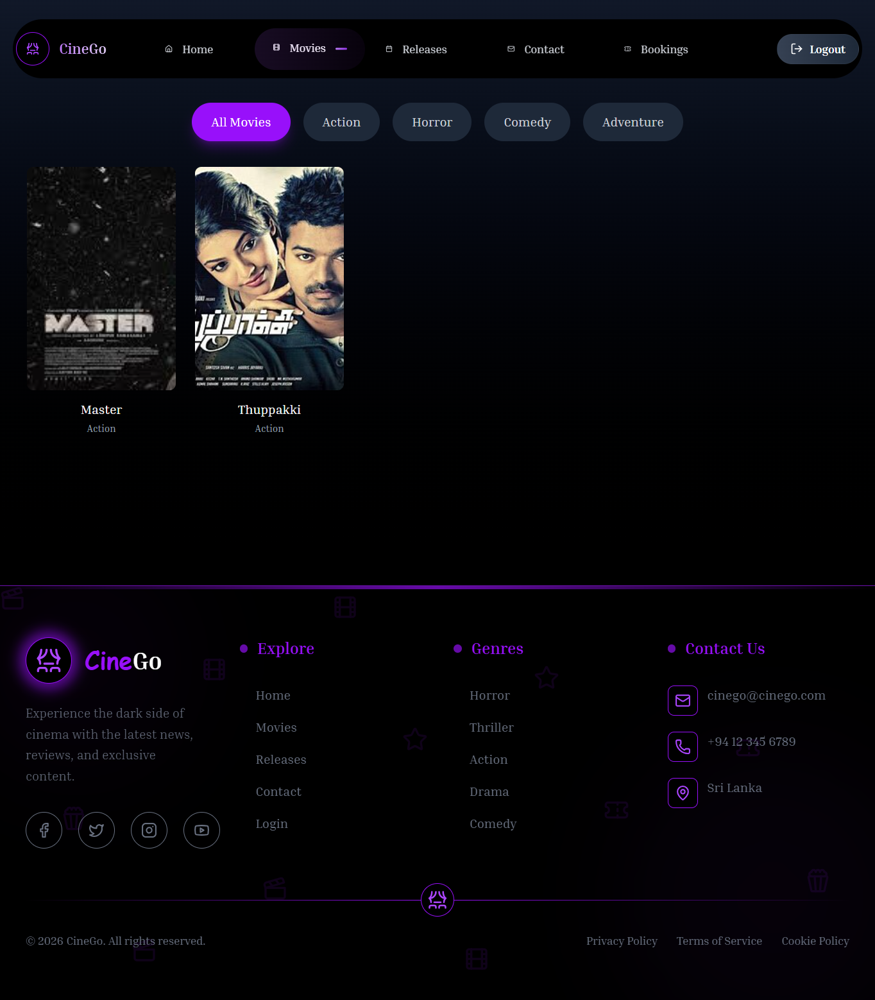

### Movie Detail

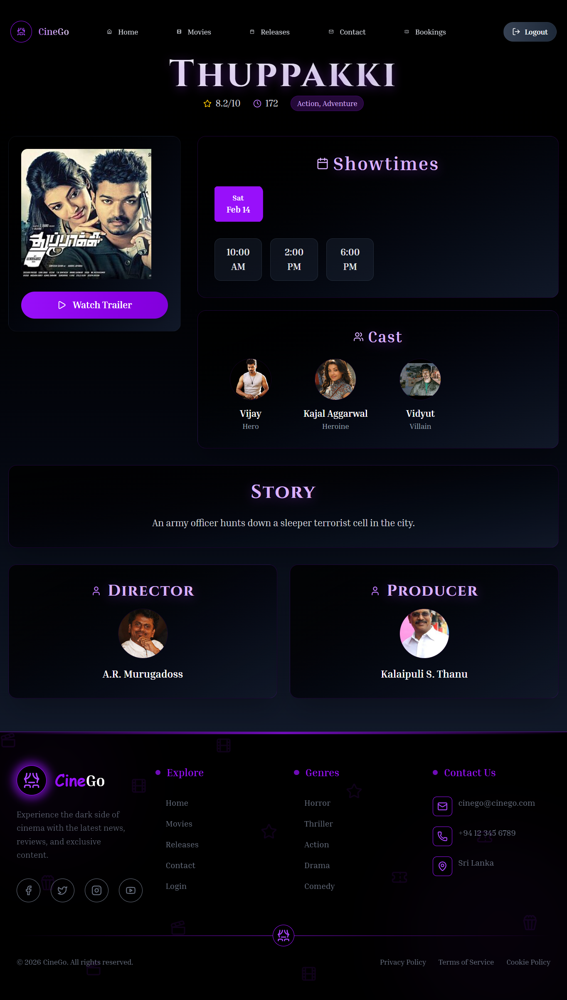

### Seat Selector

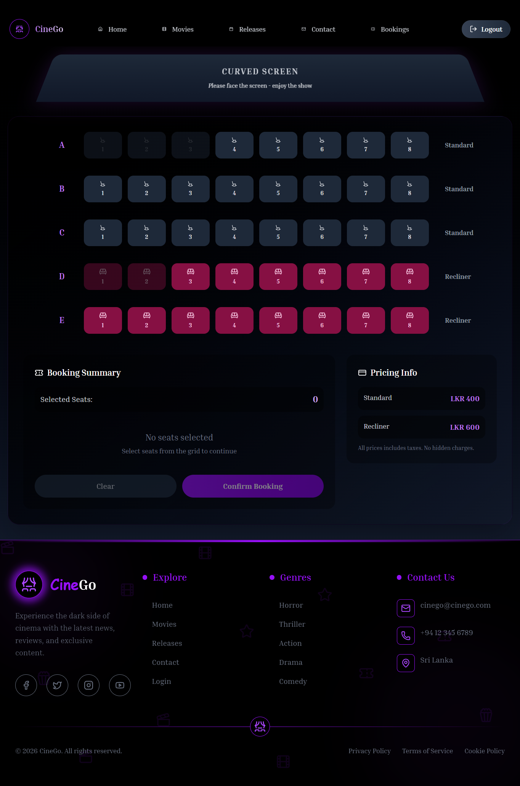

### Bookings

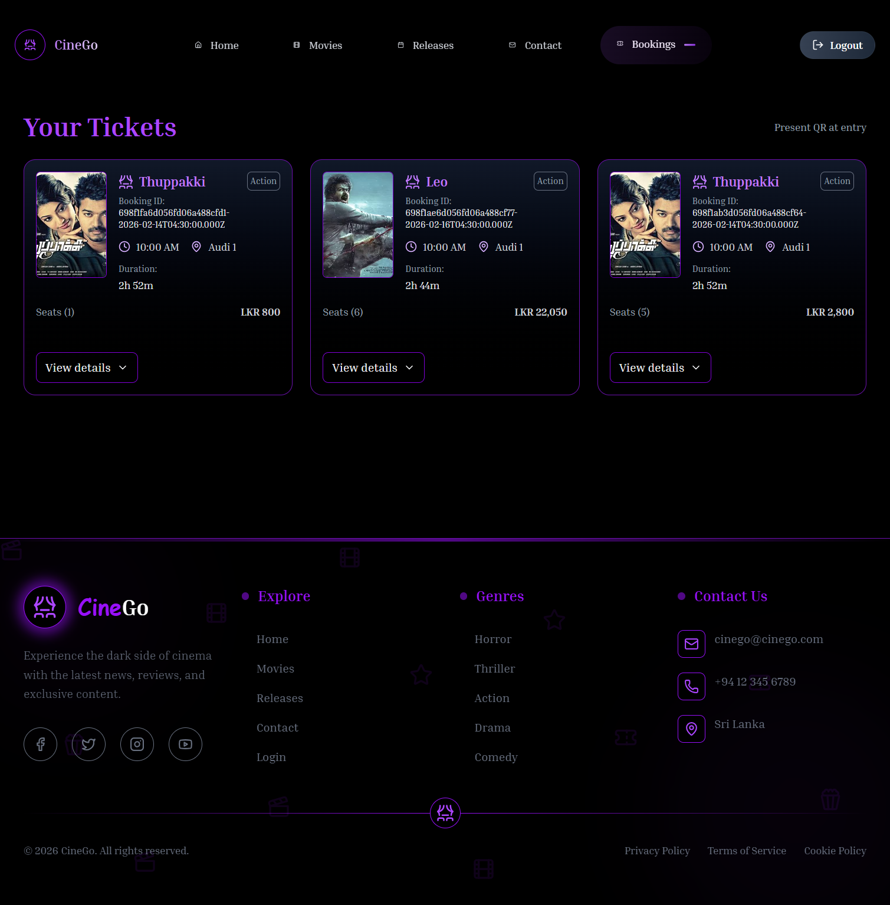

### Login

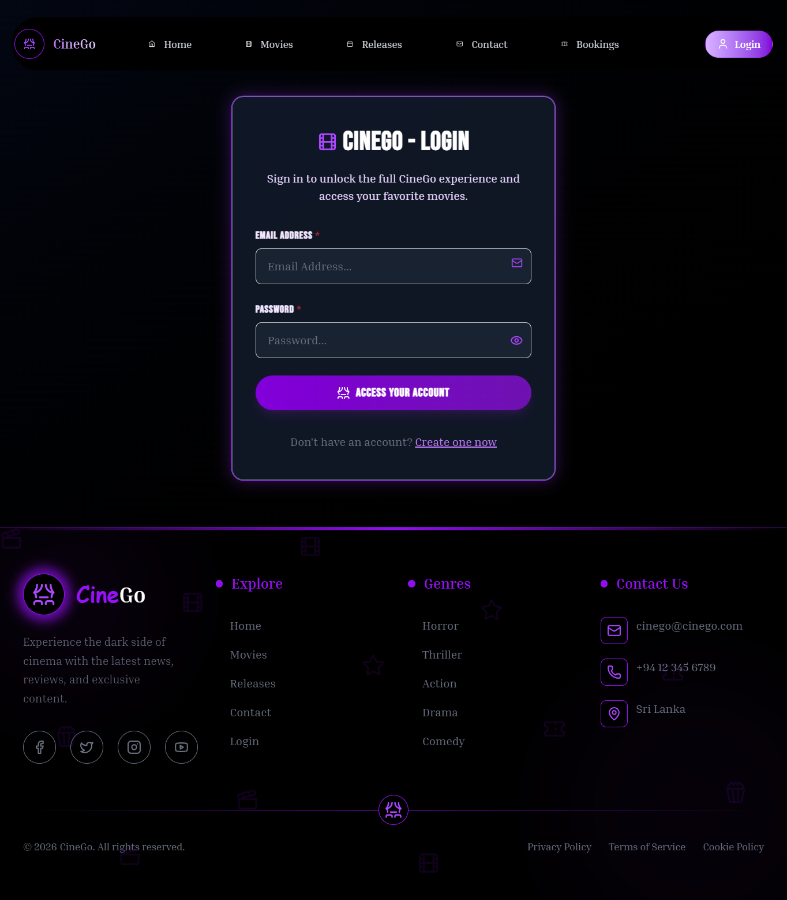

### Sign Up

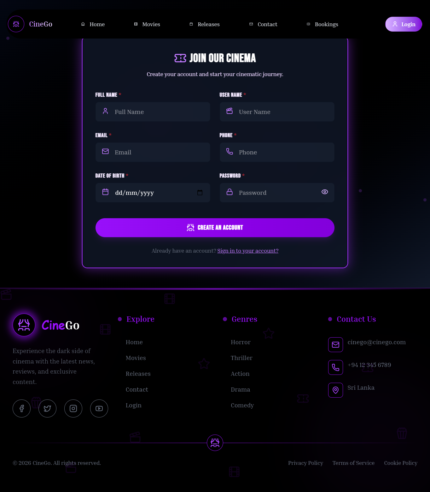

### Contact

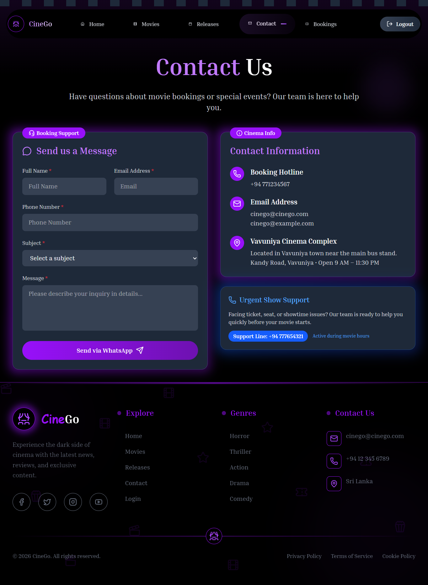

### Release Soon

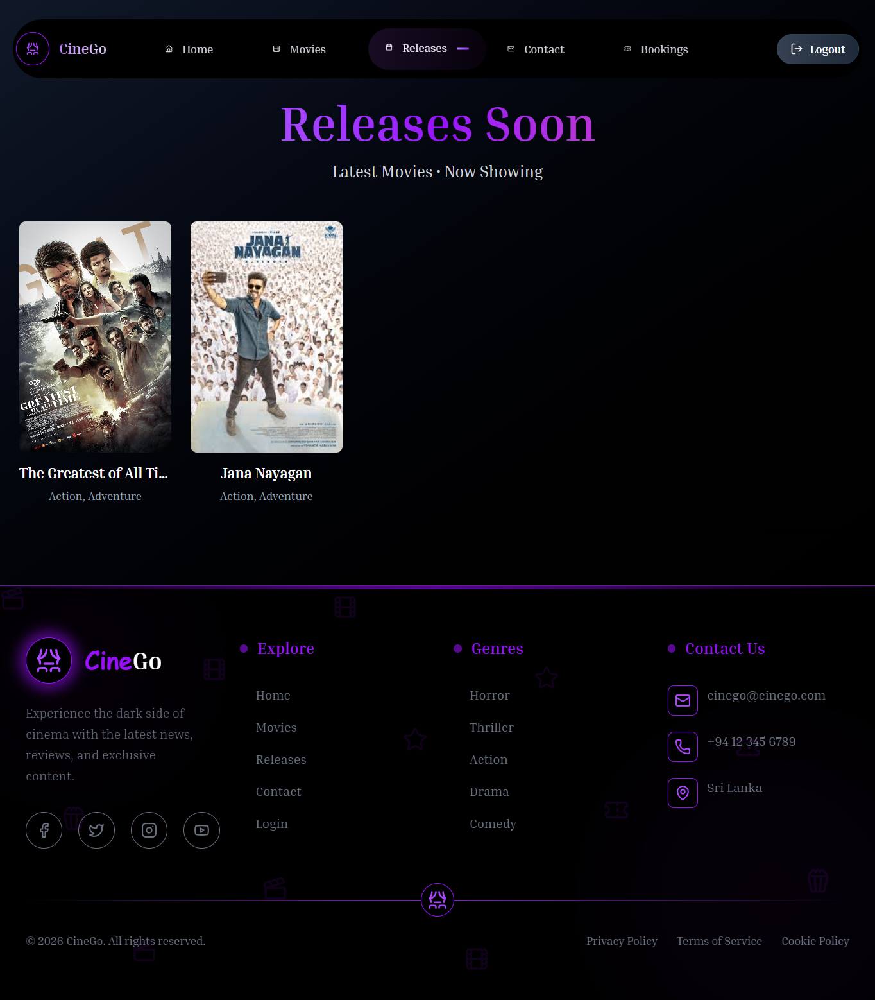

---

## 🛠 Admin Panel

### Dashboard

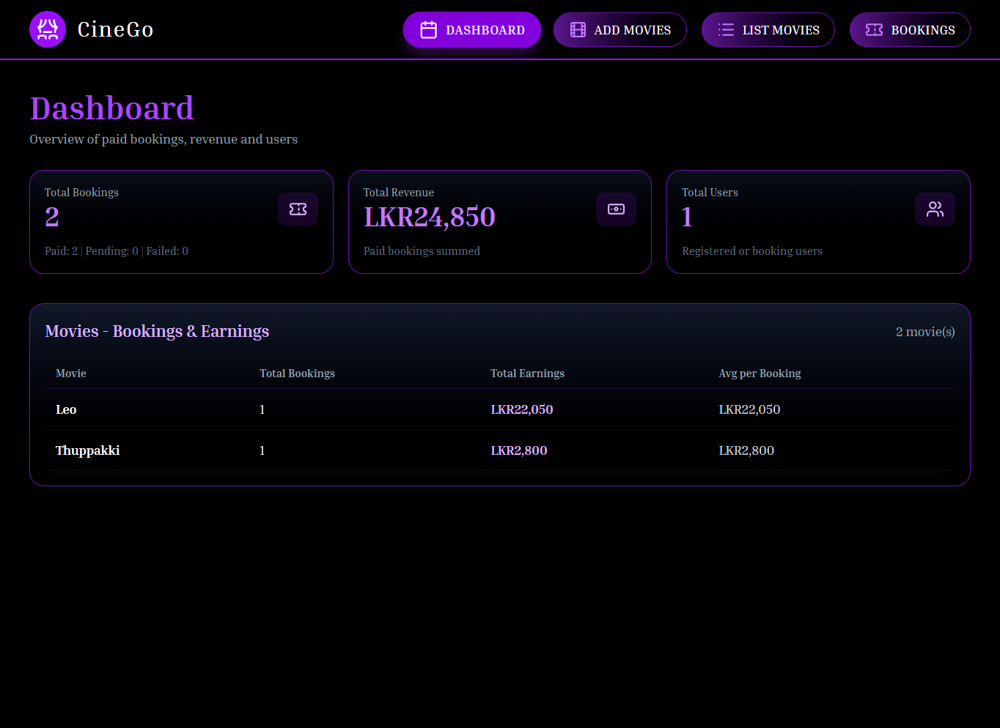

### Add Movie

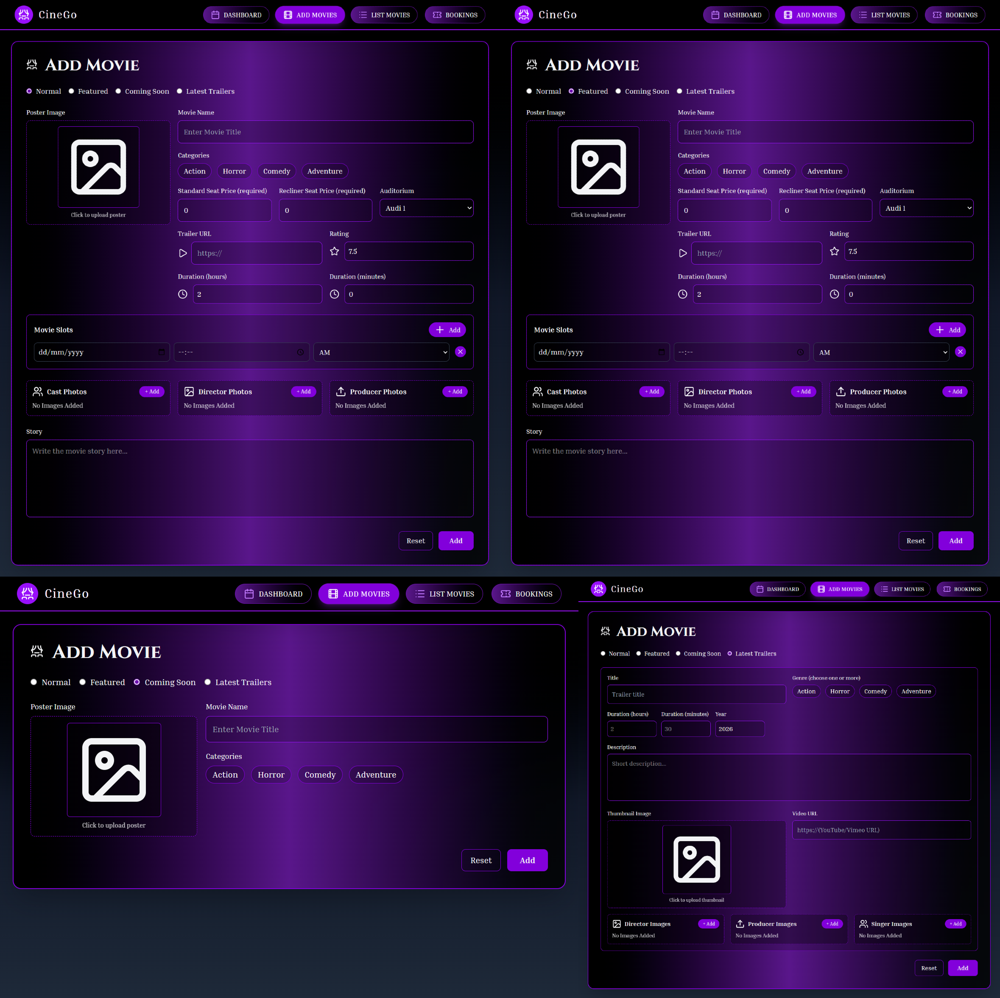

### List Movies

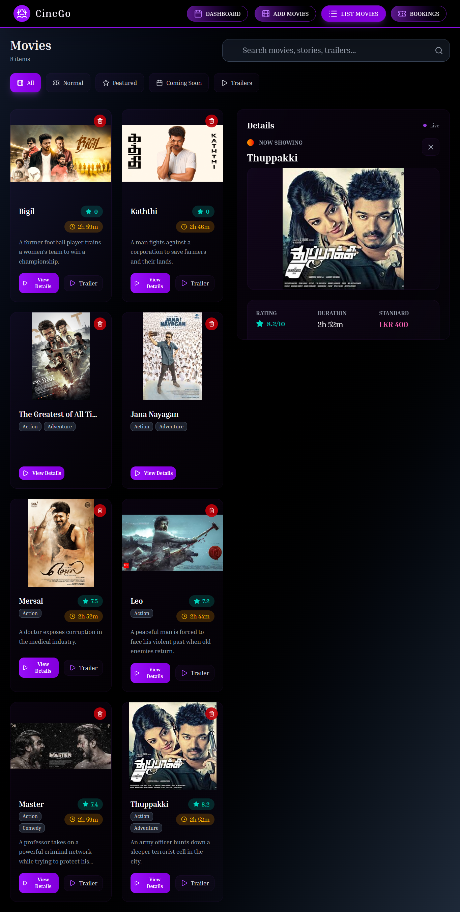

### Bookings

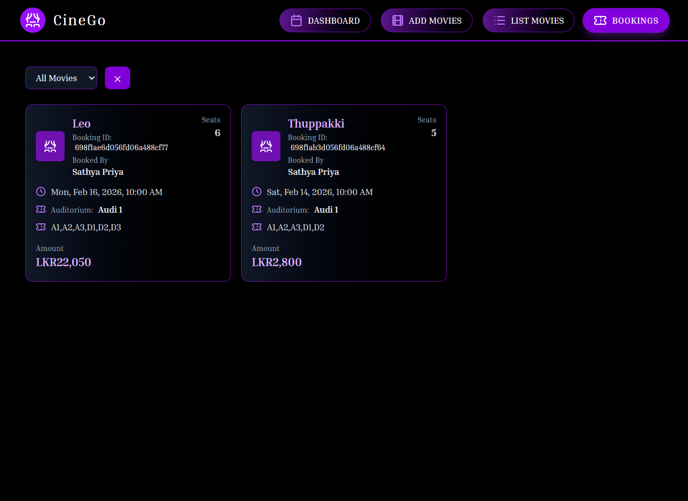

---

# ⚙️ How to Run the Project

## 1️⃣ Clone Repository

```bash
git clone https://github.com/PrethigahShanmugarajah/CineGo.git
cd CineGo
```

---

## 2️⃣ Backend Setup (Server)

```bash
cd Server
npm install
npm run server
```

---

## 3️⃣ Client Setup

```bash
cd Client
npm install
npm run dev
```

---

## 4️⃣ Admin Panel Setup

```bash
cd Admin
npm install
npm run dev
```

---

# 🔑 Environment Variables

## 📂 Server (.env)

```
PORT=5000
MONGODB_URL=
JWT_SECRET=
JWT_EXPIRES_IN=
API_URL=
FRONTEND_URL=
STRIPE_SECRET_KEY=
STRIPE_API_VERSION=
```

---

## 📂 Client (.env)

```
VITE_BASEURL=
```

---

## 📂 Admin (.env)

```
VITE_BASEURL=
```

---

# 👨‍💻 Author

**Prethigah Shanmugarajah (2020/2021)** </br>
Department of Software Engineering </br>
Faculty of Computing </br>
Sabaragamuwa University of Sri Lanka </br>

---
